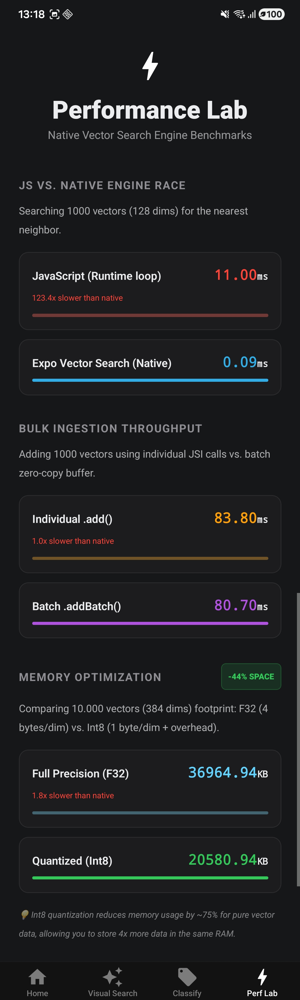

# Expo Vector Search

A high-performance, on-device **vector search engine** demonstration for Expo and React Native. This project showcases the capabilities of the `expo-vector-search` module, providing a real-world implementation of semantic similarity search and machine learning features without server-side dependencies.

## Key Features

- **Blazing Fast On-Device Search**: Sub-millisecond similarity search over 10,000+ vectors using the HNSW algorithm.
- **Privacy-First Architecture**: All vector indexing and similarity matching occurs locally on the device.
- **Production-Grade Features**: Support for Int8 quantization, native persistence, and high-fidelity JSI communication.
- **Cross-Industry Use Cases**:
  - **E-commerce**: Visual product similarity matching.
  - **Support**: Automated message classification and routing.
  - **Safety**: On-device moderation and anomaly detection.

3. **Application Layer**: A modern Expo app demonstrating real-world use cases, benchmarks, and diagnostic tools.

## How it Works

Unlike traditional databases that search for exact matches (e.g., "Product ID = 123"), this engine uses **Vector Embeddings**. 
- **Embeddings**: Data (images, text) is converted into an array of numbers (vectors) that represent its meaning.
- **Distance**: The "similarity" between two items is calculated using the **Cosine Distance** between their vectors.
- **HNSW Algorithm**: Instead of checking every single item (slow), we use a mathematical graph that lets us jump through the data to find the nearest neighbors in sub-millisecond time.

## Project Structure

This repository is organized as a monorepo-style Expo project:

```text
├── app/                    # Demo Application (Expo Router)
│   ├── (tabs)/             # Main search and performance lab screens
│   └── ...
├── modules/
│   └── expo-vector-search/ # Core Engine (Native Module)
│       ├── ios/            # Swift & C++ bindings for iOS
│       ├── android/        # Kotlin & C++ (JNI) for Android
│       ├── src/            # TypeScript API & types
│       └── README.md       # Technical module documentation
├── assets/                 # Demo assets (product data & images)
├── scripts/                # Python scripts for data generation
└── README.md               # You are here
```

## Getting Started

### Prerequisites

- Node.js and npm/yarn.
- Expo Go or Development Build environment.

### Installation

1. Clone the repository and install dependencies:
   ```bash
   npm install
   ```

2. Start the development server:
   ```bash
   npx expo start
   ```

3. Run the application:
   - For Android: Press `a`.
   - For iOS: Press `i`.
   - *Note: This project requires a development build to run the custom native module.*

## Demo Data Setup

To test the **Visual Search** demo, you need to download and process the sample product dataset. Follow these steps:

### 1. Prerequisites (Python)
Ensure you have Python 3.8+ installed. Install the processing dependencies:
```bash
pip install -r scripts/requirements.txt
```

### 2. Download & Process Data
Run the following commands from the **project root**:

```bash
# Step A: Download the dataset and convert to JSON (~150MB)
python scripts/download_and_convert_products.py

# Step B: Split the dataset into optimized chunks for the mobile app
python scripts/split_dataset.py
```

### 3. Verify
After running the scripts, your `assets/chunks/` directory should contain multiple `.json` files and an `index.ts`. The app will automatically load these files on the next launch.

## Platform Support

> [!IMPORTANT]
> The current version of this module has been primary developed and **thoroughly tested on Android**. 
> - **Android**: Fully supported (tested on Galaxy S23 FE).
> - **iOS**: Architecture is ready, but full native implementation and verification are planned for a future release.

## Module Documentation

The core logic resides in the `modules/expo-vector-search` directory. For detailed API documentation, performance specifications, and implementation details, please refer to the [Module README](./modules/expo-vector-search/README.md).

## Performance and Benchmarks

The application includes a built-in benchmark tool that compares the native C++ implementation against a naive JavaScript baseline. 

**Real-world benchmarks (Galaxy S23 FE):**
- **Search Latency**: **0.08ms** (vs 10.51ms in JS loop) -> **130x speedup**.
- **Memory Footprint (10k vectors, 384 dims)**:
  - **Full Precision (F32)**: 36,964.94 KB (~37 MB)
  - **Quantized (Int8)**: 20,580.94 KB (~21 MB) -> **45% savings**.
- **Bulk Insert**: **74.44ms** for 1,000 vectors using `addBatch`.



## Acknowledgements

- **[USearch](https://github.com/unum-cloud/usearch)**: The high-performance C++ engine powering the similarity search.
- **[Expo Modules SDK](https://docs.expo.dev/modules/overview/)**: For the robust infrastructure that makes JSI modules accessible in the Expo ecosystem.
- **[Crossing Minds](https://huggingface.co/datasets/crossingminds/shopping_queries_image_features)**: For the sample product dataset.

## License

This project is licensed under the [MIT License](./LICENSE).

---
*Maintained with a focus on high-performance mobile engineering.*
